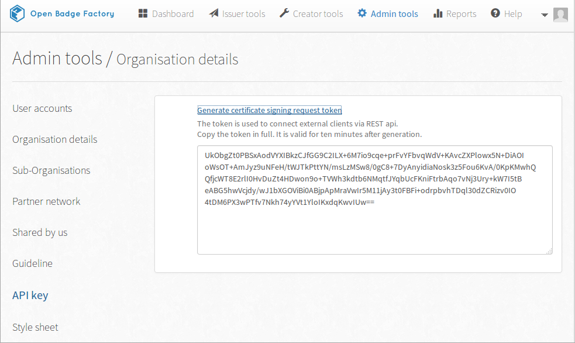

# Setting up the plugin

1. Activate the plugin through the **Plugins** menu in WordPress
2. Get the Open Badge Factory API certificate from Open Badge Factory (**Admin tools > Api Key > Generate certificate signing request token**)

3. Enter the generated Open Badge Factory API key in your wordpress' **Open Badge Factory > OBF Integration** -page to enable badge sharing.
4. Set up awarding rules for your badges in your wordpress' **Open Badge Factory > Awarding Rules** -page.
